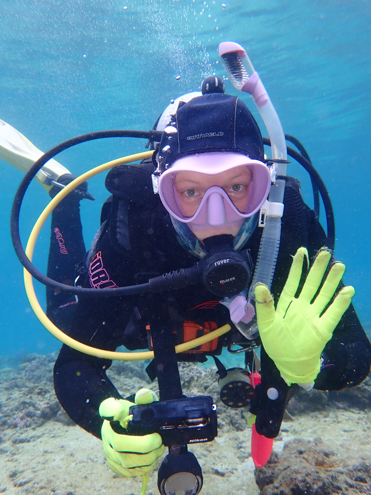

# **Welcome to Catheline Froehlich's Research**

Catheline is a behavioural ecologist interested in linking animal behaviour and ecological changes in the environment. She studies animal behaviour, environmental disturbances, coral reefs, artificial reefs, mutualistic relationships, fish telemetry, and fisheries management. Follow her work and outreach on twitter @[gobyprincess](https://twitter.com/gobyprincess).

Catheline is currently a PhD Fellow at the University of Wollongong and also the first fellow to receive the Zoltan Florian Marine Biology Fellowship through the Lizard Island Doctoral Fellowship Program from the Australian Museum. 

Catheline is also a councillor for the [Australian Coral Reef Society](https://australiancoralreefsociety.org/). The society is the world's oldest group of coral reef scientists and conservationists (since 1922). Jump on our twitter for the latest news of what we've been up to @[AustCoralReefs](https://twitter.com/AustCoralReefs).

Catheline co-founded a podcast [The Graduates Sci-Com](https://open.spotify.com/show/7nwpzT5IpeH6cNgyJHaGVB?si=-WoJfjbJRHOnp4oTdoqL6w&nd=1) aimed at explaining science in the most hilarious way possible. Listen in and jump on our twitter @[gradscicomm](https://twitter.com/gradscicomm).

</a>

