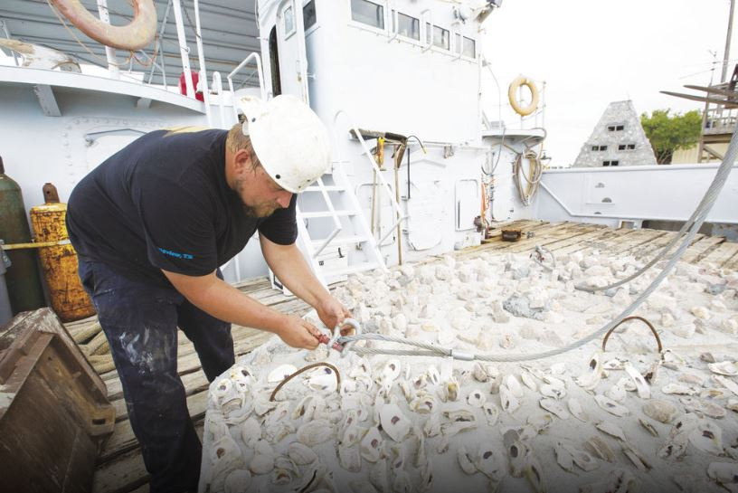
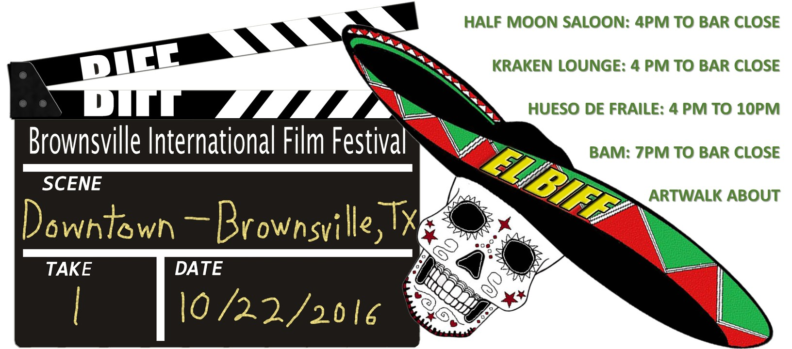

```{r setup, include=FALSE}
knitr::opts_chunk$set(message=FALSE,warning=FALSE, cache=TRUE)
```
_______________________________________________________________________
_______________________________________________________________________

# Why losing these tiny, loyal fish to climate change spells disaster for coral
"If you’ve ever dived on a coral reef, you may have peeked into a staghorn coral and seen small fish whizzing through its branches. But few realise that these small fish, such as tiny goby fish, play a crucial role in helping corals weather the storm of climate change..."
Read more:
https://theconversation.com/photos-from-the-field-why-losing-these-tiny-loyal-fish-to-climate-change-spells-disaster-for-coral-167119

<a href = "https://theconversation.com/photos-from-the-field-why-losing-these-tiny-loyal-fish-to-climate-change-spells-disaster-for-coral-167119"> 
</a>
_______________________________________________________________________

# Why do gobies and corals live together?
"Why do gobies remain in their corals and what does the coral get out of it? It turns out that coral gobies and their corals have a mutually beneficial relationship whereby they each benefit from each other’s presence..."
Read more:
https://lirrf.org/posts/why-do-gobies-and-corals-live-together/

<a href = "https://lirrf.org/posts/why-do-gobies-and-corals-live-together/"> 
</a>
_______________________________________________________________________

# Corals and goby fishes showing signs of recovery at Lizard Island
"Corals and goby fishes are slowly recovering, less than 3 years after the devastating climatic events that occurred at Lizard Island. While this is great news for Lizard Island, more recovery time is needed. The last 5 years have been rough for the reef, with two consecutive cyclones and two back-to-back mass bleaching events taking place..."
Read more:
https://lirrf.org/posts/corals-and-goby-fishes-showing-signs-of-recovery-at-lizard-island/

<a href = "https://lirrf.org/posts/corals-and-goby-fishes-showing-signs-of-recovery-at-lizard-island/"> 
</a>
_______________________________________________________________________


# From Texas to the Reef, PhD student lands prestigious fellowship
"For Catheline Froehlich the Great Barrier Reef is a long way from her old home in Texas, in the United States.
The declared, European-American has just scored the fellowship of a lifetime. Catheline has received The Zoltan Florian Marine Biology Fellowship, one of three fellowship programs operating at the Lizard Island Research Station (LIRS) on the Great Barrier Reef..."
Read more:
https://www.uow.edu.au/media/2019/from-texas-to-the-reef-phd-student-lands-prestigious-fellowship.php

<a href = "https://www.uow.edu.au/media/2019/from-texas-to-the-reef-phd-student-lands-prestigious-fellowship.php"> 
</a>
_______________________________________________________________________

# Showcasing UTRGV Research and Diving in Texas Magazine


_______________________________________________________________________

# Sea nursery: Man-made reef aimed at saving red snapper
"Studies conducted at UTRGV determined that juvenile fish need a habitat that is smaller, and separate from the larger reefs, in order to have a safe environment from predators.
'We’re hoping to increase the number of red snapper and aid the fisheries in general,' said Catheline Froehlich, who holds a master of science in biology from UTRGV legacy institution UTB/TSC. 'They have a lot of pressure right now from overfishing.'"
Read more:
https://myrgv.com/the-valley-morning-star/2017/07/13/sea-nursery-man-made-reef-aimed-at-saving-red-snapper/

<a href = "https://myrgv.com/the-valley-morning-star/2017/07/13/sea-nursery-man-made-reef-aimed-at-saving-red-snapper/"> 
</a>
_______________________________________________________________________


# Catheline's hobbies were featured in the news

Organising and Founding the Brownsville International Film Festival
"Brownsville has a rich history as a film locale, with movies such as “La Banda del Carro Rojo” (1978) and “Back Roads” (1981) to “Endgame” (2015). This Saturday, it will be the site of a festival with about 100 movies from across the globe."
Read more:
https://www.utrgvrider.com/a-view-to-the-world-in-downtown-brownsville/

<a href = "https://www.utrgvrider.com/a-view-to-the-world-in-downtown-brownsville/
"> 
</a>