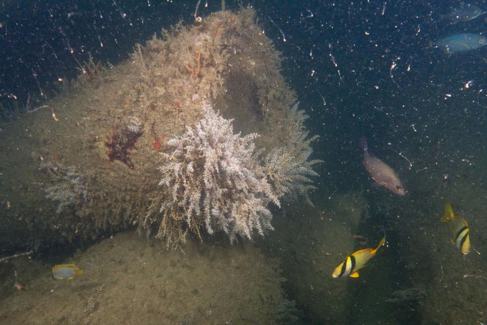

```{r setup, include=FALSE}
knitr::opts_chunk$set(message=FALSE,warning=FALSE, cache=TRUE)
```

# Linking Animal Behaviour, Mutualisms and Environmental Change

As environmental disturbances become more intense and frequent, there are many changes that have been documented at population levels and ecosystem levels. We have yet to uncover how such disturbances affect the behaviour of animals, which is critical for the maintenance of many populations and could prove detrimental to particular species or even groups of species. Importantly, many animal relationships exist among different organisms, and mutualistic relationships are key for the maintenance of several ecosystems. Accordingly, changes to animal behaviours and ecological relationships may have flow-on effects on ecosystems. For my research, I aim to delve deeper into the potential environmental consequences on animal behaviour for mutualistic organisms. I use a combination of observational, manipulative, and phylogenetic approaches to link animal behaviour and environmental change for coral-dwelling gobies, which live exclusively in some of the corals most susceptible to coral damage and death from cyclones and bleaching-induced heatwaves.

Collaborators: Marian Y.L. Wong, O. Selma Klanten, Siobhan J. Heatwole, Martin L. Hing, Mark Dowton

<a href = "https://www.biorxiv.org/content/10.1101/2021.01.13.426488v1">

</a>
_______________________________________________________________________

# Social Behaviour of Coral Reef Fishes

Animals often live in groups temporarily or permanently for a variety of ecological, social, and life history reasons. For several marine fishes, size hierarchies are established to maintain the peace in which the two biggest individuals breed and the rest control their growth and forgo reproduction to maintain group membership. I aim to uncover key evolutionary mechanisms for the maintenance of group membership and size hierarchies in such animals. Two fish groups that are of particular focus for my research are coral-dwelling gobies and anemonefishes.

Collaborators: Marian Y.L. Wong, O. Selma Klanten, Siobhan J. Heatwole, Martin L. Hing, Theresa Rueger, Peter M. Buston, Rebecca Branconi

<a href = "https://www.frontiersin.org/articles/10.3389/fmars.2021.665780/full"> 
</a>
_______________________________________________________________________

# Coupling Fisheries Management and Animal Behaviour

Over decades and centuries, fisheries have changed fish populations and we are only beginning to understand the degree of these impacts. Management agencies have used available monitoring data to attempt to remove overfishing stress for many taxa, yet many species are continuing to experience excessive fishing pressure. Many fish are exhibiting behavioural changes, size truncations and lower reproductive capacity from fishing pressure, which have detrimental consequences on population maintenance and conservation. Accordingly, my research aims to understand how fish movement, size and growth, and reproduction are affected by fisheries, and to provide suggestions to improve management of these fisheries. I have particular experience with red snapper, <i>Lutjanus campechanus</i>.

Collaborators: Richard J. Kline, Andres Garcia, Carlos E. Cintra-Buenrostro, Adam M. Lee, Ramiro Oquita, David W. Hicks, J. Dale Shively, J. Brooke Shipley

 
[Image by Seth Patterson](https://www.flickr.com/photos/spatterd/)


_________________________________________________________________________

# Artificial Reef Research

Artificial reefs (i.e., man-made reefs) are critical habitat for many marine taxa that live in environments with limited natural habitat and/or degraded habitat. Although artificial reefs have been deployed or accidentally created (e.g. through shipwrecks) for decades and centuries, we have yet to understand the optimal arrangements and structural characteristics necessary for artificial reefs to mimic natural habitat. Accordingly, my research aims to identify optimal habitat characteristics and formations for the deployment of artificial reef habitat that effectively mimics natural habitat.

Collaborators: Richard J. Kline, Andres Garcia, Carlos E. Cintra-Buenrostro, Adam M. Lee, Rachel N. Arney, Ramiro Oquita, David W. Hicks

 
[Image by Seth Patterson](https://www.flickr.com/photos/spatterd/)

