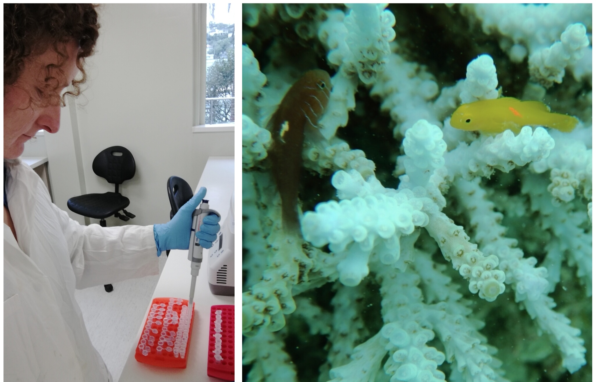

```{r setup, include=FALSE}
knitr::opts_chunk$set(message=FALSE,warning=FALSE, cache=TRUE)
```


# Linking Animal Behaviour and Environmental Change

As environmental disturbances become more intense and frequent, there are many changes that have been documented at population levels. For my research, I am to delve deeper into the potential consequences for animal behaviour.


# Social Behaviour of Coral Reef Fishes


# Fisheries Management


# Artificial Reef Research

